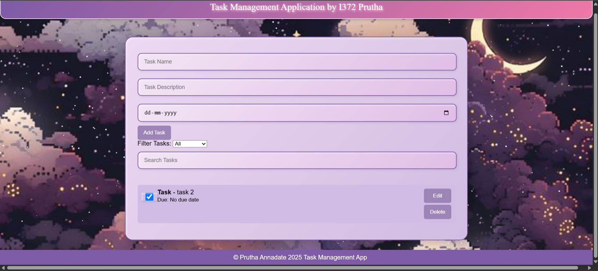
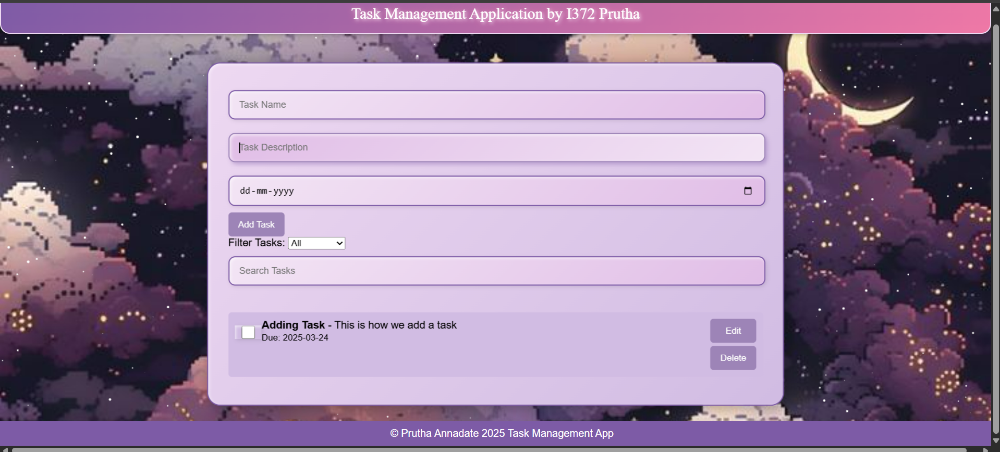
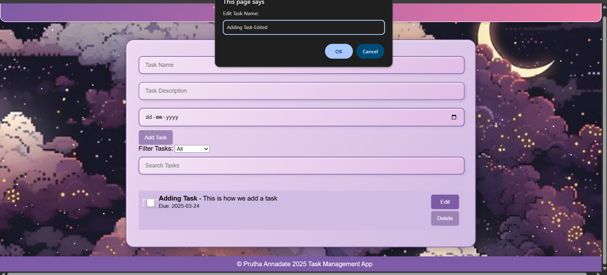
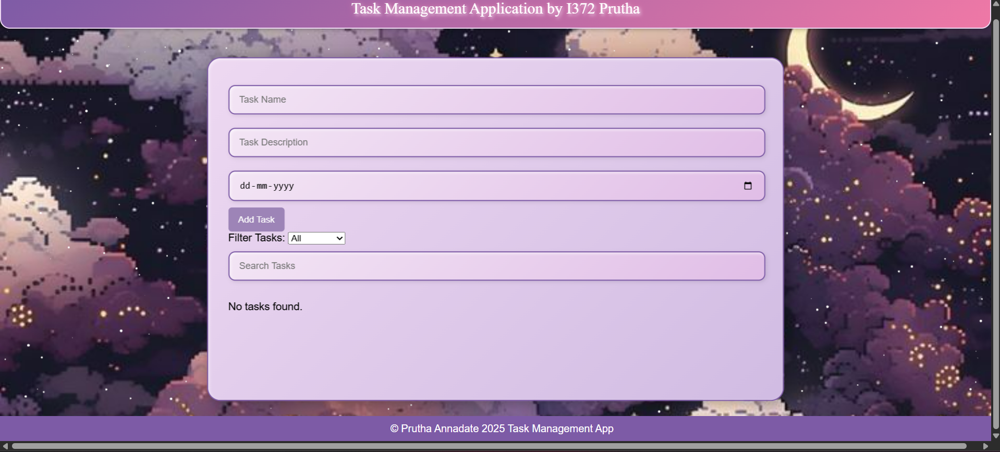
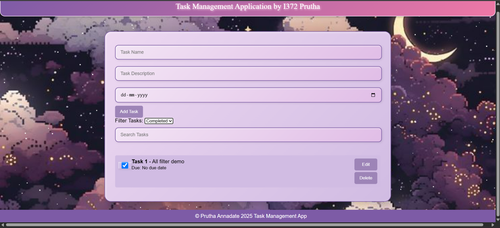
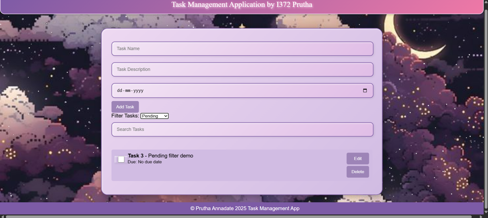

# task-tracker

task-tracker is a sleek and user-friendly Task Management Application built with HTML, CSS, and JavaScript. Effortlessly add, edit, delete, and toggle tasks with due dates. Features a beautiful animated background, persistent data storage via Local Storage, and filtering options for enhanced productivity.

## Installation

Clone the repository using:

```bash
git clone https://github.com/chibihime/task-tracker.git
```

Navigate to the folder:

```bash
cd task-tracker
```

Open `index.html` in your browser.

## Screenshots

### Main View



### Adding a Task



### Editing & Deleting Tasks




### Filter & Search





## Contributing

Pull requests are welcome. For major changes, please open an issue first to discuss what you would like to change.

Please make sure to update tests as appropriate.

## License & Author Details

[MIT](https://choosealicense.com/licenses/mit/)
[Prutha Annadate](https://www.linkedin.com/in/prutha-annadate/)
